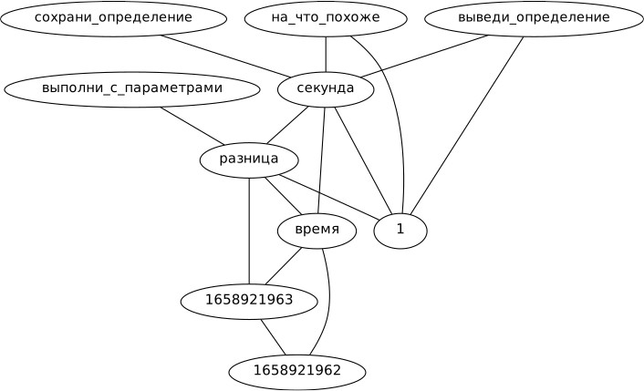

# Проект по написанию программы со свойствами сильного искусственного интелекта

## Короткое описание

В данном проекте реализуются попытки объединения знакового представления мира из области вычеслительной лингвисики и обучения интеллектуального агента. Обучение планируется всети на предметной области бытовых понятий (то чему, обычно учат детей). Цель заключается в проверке возможности создания программы со совойтствами сильного искусственного интеллекта, используюя данные подходы.

## Описание на википедии

Данные описания существовали до начала этого репозиория и были найдены позже. В статьях, как я понял, есть ссылки на реализации определенных систем, но судя по всему они не пользуются популярностью. Так как небыло найдено завершенных реализаций, работу над репозиторием было решено продолжить. Цель данного репозитория, наверное, полностью повторяет описываемые сущности в данных статьях.

* https://en.wikipedia.org/wiki/Deliberative_agent
* https://en.wikipedia.org/wiki/Belief–desire–intention_software_model

## Иллюстрация работы

В процессе диалога с программой генерируется граф.

Текст диалога.

*Человек*: время 1658921962

*Человек*: время 1658921963

*Человек*: выполни_с_параметрами разница 1658921963 1658921962

*Программа*: 1

*Человек*: сохрани_определение секунда 1 разница время

*Человек*: выведи_определение секунда

*Программа*: 1 разница время

*Человек*: на_что_похоже 1 разница время

*Программа*: секунда

## Список предпологаемы свойств (редактируется)

1. Любая информайия воспринимается как понятие с какой-то логикой работы и кодируется каким-то знаком.
1. Логика работы уточняется, по мере работы с реальным миром.
1. Над понятиями реализовать все элементарные операции (поиск, добавление, изменение удаление, и, или, не).
1. Воспринимать любую предметную область.
1. Разбираться в системе любой сложности. Т е с любым количеством элементов и связей. 
1. Вывод новых знаний.
1. Вывод закономерностей.
1. Различать вопросы и утверждения. Отвечать на вопросы.
1. Давать определение новых понятий из более фундоментальных определений.
1. Помечать некоторые понятия как синонимы.
1. Хранить и использовать последовательность записей во времени.
1. Помечать понятия как истинные или ложные.
1. Предложение гипотез.
1. Разделение памяти на локальную и глобальную.
1. Работа в режиме копирования с обратной связью.
1. Работа с несколькими языками естественными и язяками программирования.
1. Построение алгоритмов.
1. Абстрагирование.
1. Созданеие несущестующих понятий.
1. Работа с другим интеллектуальным агентом.
1. Понимание причин и следсвий, функций и свойств.
1. Выделение сигнала из шума.
1. Степень выраженности любого понятия.
1. Учет контекста понятия.
1. Целеполагание. Целевой критерий, из которого выводятся локальные цели.
1. Планрование.

## Средство для просмотра графов

sudo apt install xdot
xdot

## Запуск

Команда в терминале linux:
python3 main.py

## Дополнительная документация

* Документ с описанием мыслей о целесообразности данного подхода и отличия от других подходов: docs/на_десяток_страниц.txt
* Документы с формализацией задач (не отредактированы): no_code/docs/ТЗ/Задачи/*.txt